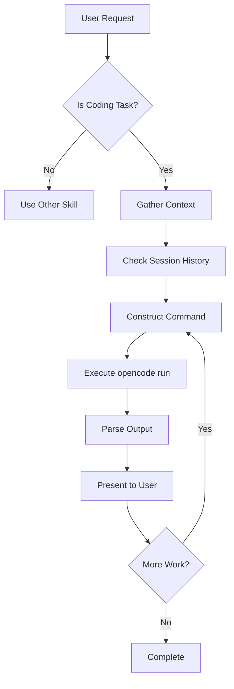

# OpenCode Agent - Agent Control Guide

**Purpose**: Detailed operational guide for OpenClaw Agent controlling OpenCode CLI.

---

## Table of Contents

1. [Integration Flow](#integration-flow)
2. [Command Decision Matrix](#command-decision-matrix)
3. [Output Parsing Guide](#output-parsing-guide)
4. [Error Recovery](#error-recovery)
5. [Performance Optimization](#performance-optimization)
6. [Complete Workflows](#complete-workflows)

---

## Integration Flow

### When Agent Receives User Request



### Step-by-Step Execution

#### Step 1: Intent Recognition

**Check if request matches coding task patterns:**

```python
def is_coding_task(request):
    coding_keywords = [
        'implement', 'build', 'create', 'write code', 'generate',
        'review', 'audit', 'check', 'analyze code',
        'refactor', 'improve', 'optimize',
        'fix bug', 'debug', 'resolve error',
        'explain', 'what does', 'how does',
        'api', 'database', 'function', 'class', 'interface'
    ]
    return any(kw in request.lower() for kw in coding_keywords)
```

**Negative Checks:**
- Documentation writing → Use file editing
- Content translation → Use translation skill
- General conversation → Use chat skill

#### Step 2: Context Gathering

**A. File Context**

```bash
# If user mentions specific file(s)
if "file.ts" in request:
    attach_files = ["file.ts"]

# If user mentions module/directory
if "auth module" in request:
    attach_files = glob("src/auth/*.ts")

# If error provided
if "error" in request.lower():
    attach_files = ["logs/error.log", "src/context.ts"]

# Limit to max 10 files
attach_files = attach_files[:10]
```

**B. Session Context**

```bash
# Check latest sessions
sessions = opencode session list --format json

# Determine if continuing task
if "continue" in request or "add" in request:
    use_continue = True
else:
    use_continue = False
```

#### Step 3: Construct Command

**Basic Pattern:**
```bash
opencode run "<enhanced_prompt>" [FLAGS]
```

**Enhance Prompt:**
1. Add constraints from user
2. Add requirements from context
3. Add best practices
4. Add error handling

**Example:**
```
Original: "Implement user registration"

Enhanced: "Implement user registration feature with:
- Password hashing (bcrypt)
- JWT token generation
- Email verification
- Input validation
- Error handling
- Unit tests
```

#### Step 4: Execute

```bash
# Execute command
opencode run "enhanced prompt" --file file.ts

# Monitor for timeout (max 120s)
# Parse output
# Present results
```

#### Step 5: Present to User

**For plain text output:**
- Summarize if > 200 words
- Highlight key points
- Show code blocks with syntax highlighting

**For JSON output:**
- Parse events
- Extract text content
- Log tool calls
- Present final result

---

## Command Decision Matrix

### Decision Table

| Scenarios | User Intent | Context | Command | Flags |
|-----------|-------------|---------|---------|-------|
| **New Implementation** | "Implement X" | New project | `opencode run "Implement X"` | `--file` (if context) |
| **Continue Task** | "Add Y", "Continue" | Existing task | `opencode run --continue "Add Y"` | `--file` (if new context) |
| **Review Single File** | "Review file.ts" | Single file | `opencode run --file file.ts "Review"` | None |
| **Review Module** | "Review auth" | Multiple files | `opencode run -f f1.ts -f f2.ts "Review"` | Multiple `--file` |
| **After Implementation** | "Review my changes" | Just implemented | `opencode run --continue "Review changes"` | `--file` (if needed) |
| **Fork Alternative** | "Try a different way" | Risky/Ambiguous | `opencode run --continue --fork "Try X"` | `--fork` |
| **Code Explanation** | "Explain this" | Codebase context | `opencode run "Explain X"` | `--file` (if specified) |
| **Bug Fix** | "Fix this bug" | Error context | `opencode run -f error.log "Fix bug"` | `--file` error log |
| **Deep Reasoning** | "Analyze architecture" | Complex task | `opencode run -m claude-sonnet-4 "Analyze"` | `--model` |
| **Fast Task** | "Add simple function" | Simple | `opencode run "Add function"` | None |

### Flag Selection Rules

| Flag | When to Use | Why |
|------|-------------|-----|
| `--continue` | Task continuation, follow-up | Preserve context |
| `--session <id>` | Specific session mentioned | Restore exact conversation |
| `--fork` | Risky change, multiple approaches | Preserve original |
| `--file` | Context provided | Better understanding |
| `--model` | Complex/Deep reasoning | Better quality |
| `--format json` | Need programmatic output | Parse events |

---

## Output Parsing Guide

### Plain Text Output

**Structure:**
```
[Explanation text...]
[Code blocks...]
[Recommendations...]
```

**Parsing Strategy:**

```python
def parse_plain_text(output):
    # Extract code blocks
    code_blocks = re.findall(r'```(\w+)?\n(.*?)\n```', output)

    # Extract key points
    key_points = re.findall(r'^[\-\*]\s+(.+)$', output, re.MULTILINE)

    # Extract recommendations
    recommendations = re.findall(r'^(Recommendation|Suggestion):\s*(.+)$', output, re.I)

    return {
        'explanation': output,
        'code_blocks': code_blocks,
        'key_points': key_points,
        'recommendations': recommendations
    }
```

**Presentation:**
- Show summary first
- Show code blocks with syntax
- Highlight recommendations

### JSON Event Stream

**Event Types:**

```json
// Text content
{
  "type": "text",
  "sessionID": "...",
  "part": {
    "type": "text",
    "text": "Response text",
    "time": {"start": 123, "end": 456}
  }
}

// Tool execution
{
  "type": "text",
  "part": {
    "type": "tool",
    "tool": "bash",
    "state": {
      "status": "completed",
      "input": {"command": "ls -la"},
      "output": "...",
      "error": null
    }
  }
}

// Session status
{
  "type": "session.status",
  "sessionID": "...",
  "status": {"type": "idle"}
}
```

**Parsing Strategy:**

```python
def parse_json_events(events):
    text_parts = []
    tool_calls = []
    errors = []

    for event in events:
        if event.get('type') == 'text':
            part = event.get('part', {})
            if part.get('type') == 'text':
                text_parts.append(part.get('text', ''))

        elif event.get('type') in ['step-start', 'step-finish']:
            part = event.get('part', {})
            tool_calls.append({
                'tool': part.get('tool'),
                'status': part.get('state', {}).get('status'),
                'output': part.get('state', {}).get('output', '')
            })

        elif event.get('type') == 'session.error':
            errors.append(event.get('error'))

        elif event.get('type') == 'session.status':
            if event.get('status', {}).get('type') == 'idle':
                break  # Stop parsing

    return {
        'text': ''.join(text_parts),
        'tool_calls': tool_calls,
        'errors': errors
    }
```

**Presentation:**
- Aggregate text content
- Show tool execution summary
- Report errors

### Session List Output (JSON)

**Structure:**
```json
[
  {
    "id": "ses_123...",
    "title": "Session title",
    "updated": 1234567890,
    "created": 1234567000,
    "projectId": "proj-123",
    "directory": "/path/to/project"
  }
]
```

**Usage:**
- Find latest session
- Filter by date
- Match by title pattern

---

## Error Recovery

### Error 1: File Not Found

**Symptom:** `Error: File not found: <path>`

**Recovery:**
```bash
# 1. Check if file exists
if not os.path.exists(path):
    # 2. Search workspace
    found = glob(f"**/{os.path.basename(path)}", recursive=True)
    if found:
        # 3. Use found path
        use_file = found[0]
    else:
        # 4. Ask user
        ask_user("File not found. Provide correct path?")
```

### Error 2: OpenCode Not Installed

**Symptom:** `opencode: command not found`

**Recovery:**
```bash
# 1. Check installation
command -v opencode

# 2. If missing, inform user
"OpenCode CLI is not installed. Install via: npm install -g opencode-ai"

# 3. Cannot proceed without installation
```

### Error 3: Auth Not Configured

**Symptom:** `No credentials configured`

**Recovery:**
```bash
# 1. Check auth
opencode auth list

# 2. If empty, inform user
"OpenCode needs API credentials. Run: opencode auth login"

# 3. Prompt user to login
```

### Error 4: Session Not Found

**Symptom:** `Session not found: <id>`

**Recovery:**
```bash
# 1. List sessions
sessions = opencode session list --format json

# 2. Find matching session
matching = [s for s in sessions if s['id'].startswith(user_provided_id)]

# 3. Use match or inform
if matching:
    use_session_id = matching[0]['id']
else:
    ask_user("Session not found. List available sessions?")
```

### Error 5: Timeout

**Symptom:** Execution takes > 120s

**Recovery:**
```bash
# 1. Inform user
"OpenCode is still processing, waiting..."

# 2. Re-check after 30s
# 3. If still running, ask user
"Still processing. Continue waiting or cancel?"

# 4. User decision
if user_continue:
    wait_another_60s()
else:
    cancel_operation()
```

### Error 6: API Rate Limit

**Symptom:** `Rate limit exceeded`

**Recovery:**
```bash
# 1. Inform about rate limit
"API rate limit reached. Retrying in 60s..."

# 2. Wait 60s
time.sleep(60)

# 3. Retry
retry_command()
```

---

## Performance Optimization

### Optimization 1: Use Appropriate Model

**Decision Tree:**
```
Task Type → Model Choice

Simple task (explain small function) → DeepSeek Chat (fast, cheap)
Medium task (implement feature) → Claude Sonnet (balanced)
Complex task (analyze architecture) → Claude Opus (deep reasoning)
```

**Example:**
```bash
# Fast task
opencode run -m deepseek/deepseek-chat "Fix typo in comment"

# Medium task
opencode run -m anthropic/claude-sonnet-4-20250514 "Implement user registration"

# Complex task
opencode run -m anthropic/claude-opus-4-20250514 "Analyze microservices architecture"
```

### Optimization 2: Minimize Context

**Rule:** Only attach relevant files

```python
# BAD: Attach everything
attach_files = glob("**/*.ts")

# GOOD: Attach only relevant
if "authentication" in request:
    attach_files = glob("src/auth/*.ts")
elif "database" in request:
    attach_files = glob("src/db/*.ts")
else:
    attach_files = []
```

### Optimization 3: Use Session Resume

**Advantage:** Avoids cold start

```bash
# Continue conversation
opencode run --continue "Add feature Y"

# Better than new session
opencode run "Add feature Y"  # Loses context
```

### Optimization 4: Server Mode (For Frequent Use)

**Advantage:** Persistent connections

```bash
# Terminal 1: Start server once
opencode serve --port 4096

# Subsequent commands: Faster
opencode run --attach http://localhost:4096 "Task"
```

---

## Complete Workflows

### Workflow 1: Feature Implementation (End-to-End)

```
User: "Implement user profile management"

Agent:
┌─ Step 1: Understand
│  └─ opencode run "Explain current user management: auth, sessions"
│
├─ Step 2: Plan
│  └─ opencode run --continue "Create plan for user profile management:
│     - Profile CRUD operations
│     - Update profile
│     - Upload avatar
│     - Privacy settings"
│
├─ Step 3: Implement (Database)
│  └─ opencode run --continue -f prisma/schema.prisma "Add profile table"
│
├─ Step 4: Implement (API)
│  └─ opencode run --continue -f src/api/profile.ts "Implement profile API"
│
├─ Step 5: Implement (Frontend)
│  └─ opencode run --continue -f src/components/Profile.tsx "Create profile form"
│
├─ Step 6: Test
│  └─ opencode run --continue "Write tests for profile CRUD"
│
└─ Step 7: Commit
   git checkout -b feat/user-profile
   git add .
   git commit -m "feat: add user profile management"
   gh pr create -t "feat: add user profile" -b "..."
```

### Workflow 2: Code Review (Automated)

```
User: "Review my PR #123"

Agent:
┌─ Step 1: Checkout PR
│  gh pr checkout 123
│
├─ Step 2: List Changed Files
│  git diff --name-only HEAD~1
│
├─ Step 3: Review Changed Files
│  opencode run -f file1.ts -f file2.ts "Review for:
│    - Architecture correctness
│    - Code quality
│    - Security vulnerabilities
│    - Performance issues
│    - Testing coverage"
│
├─ Step 4: Generate Fixes
│  opencode run --continue "Fix the review findings"
│
└─ Step 5: Re-review
   opencode run --continue "Re-review after fixes - any remaining issues?"
```

### Workflow 3: Bug Investigation & Fix

```
User: "Fix this: Error: Connection refused at db.ts:45"

Agent:
┌─ Step 1: Investigate
│  opencode run -f src/db/db.ts -f logs/error.log "Analyze:
│     Error: Connection refused at db.ts:45"
│
├─ Step 2: Identify Root Cause
│  opencode run --continue "What's the root cause? Check connection string"
│
├─ Step 3: Propose Fix
│  opencode run --continue "Propose fix for connection timeout issue"
│
├─ Step 4: Implement Fix
│  opencode run --continue "Implement the proposed fix"
│
├─ Step 5: Verify
│  opencode run --continue "Verify fix resolves the issue"
│
└─ Step 6: Commit
   git commit -m "fix: resolve database connection timeout"
```

### Workflow 4: Refactoring (Safe Approach)

```
User: "Refactor the auth module to be cleaner"

Agent:
┌─ Step 1: Analyze Current
│  opencode run -f src/auth/ "Analyze current auth module structure"
│
├─ Step 2: Create Plan
│  opencode run --continue "Create refactoring plan:
│     - Extract session management
│     - Separate password logic
│     - Improve error handling"
│
├─ Step 3: Fork for Refactoring
│  opencode run --continue --fork "Implement refactoring: Phase 1"
│
├─ Step 4: Test Refactored
│  opencode run -s <fork-id> "Refactoring Phase 2 - Continue"
│
├─ Step 5: Compare Before/After
│  opencode run -s <original-id> "List original auth module structure"
│  opencode run -s <fork-id> "List refactored auth module structure"
│
└─ Step 6: Decision
   If refactoring is good:
     opencode run -s <fork-id> "Apply refactoring to main branch"
   Else:
     opencode run -s <original-id> "Keep original, try different approach"
```

---

## Quick Reference for Agent

### Command Syntax

```bash
# Basic
opencode run "prompt"

# Continue
opencode run --continue "prompt"

# Fork
opencode run --continue --fork "prompt"

# With files
opencode run "prompt" --file file1.ts --file file2.ts

# Specific model
opencode run -m anthropic/claude-sonnet-4 "prompt"

# JSON output
opencode run --format json "prompt"
```

### Decision Checklist

```
✓ Is this a coding task?
✓ Need to attach files? Which ones?
✓ Continue existing or start new?
✓ Fork for safety?
✓ Which model is appropriate?
✓ Use plain text or JSON?
✓ Handle errors gracefully?
```

### Best Practices

1. **Use `--continue` liberally** — Preserve context
2. **Attach relevant files** — Better understanding
3. **Fork risky changes** — Don't break original
4. **Choose appropriate model** — Balance speed vs quality
5. **Parse output carefully** — Extract key info
6. **Present clearly** — Summarize, highlight
7. **Handle errors** — Provide context, suggest fixes
